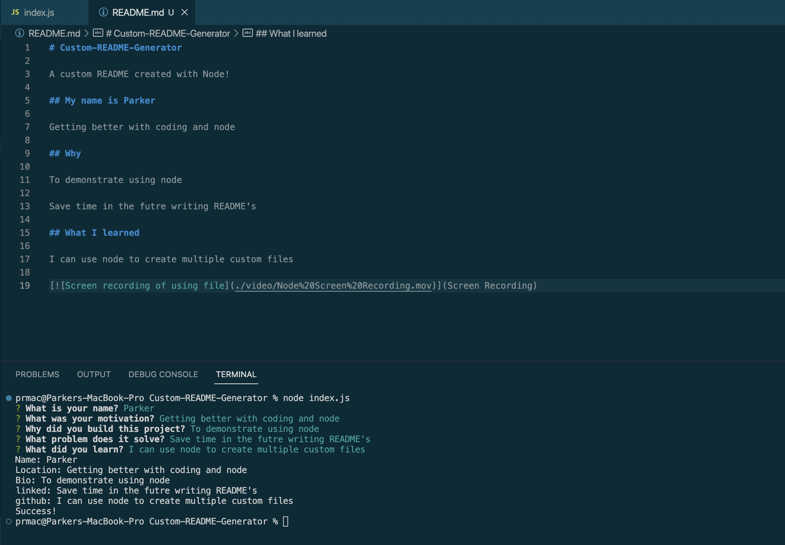

# Custom README Generator

## Description

An application that will create custom READMEs based off of user input

## Table of Contents

- [Installation](#installation)
- [Usage](#usage)
- [Credits](#credits)
- [License](#license)

## Installation

Make sure that inquirer and fs are installed

## Usage

type node index.js or npm start to run the files

[Screen recording of using file](https://youtu.be/kcY75H0SkpE "Screen recording of using file")

## License

GNU GPLv3

## Contributing

GitHub Docs, this week's mini project

## Tests

run the test script

## Questions

GitHub username: Priddle88

GitHub profile: [Link to Profile](https://github.com/Priddle88)

Reach out to parkerriddle09@gmail.com (with your first name included) if you have any questions!
